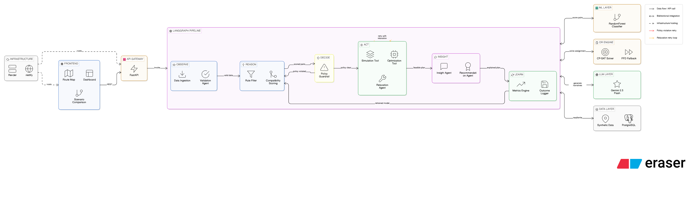
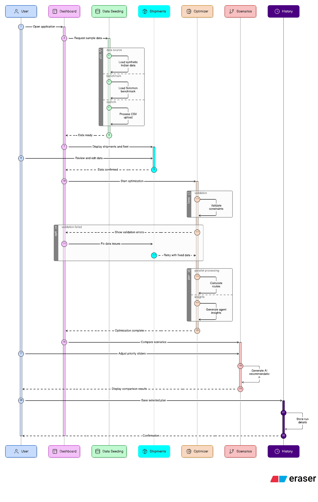

# 🚛 Lorri AI
## Taqneeq CyberCypher R2 - Problem Statement 2
### Agentic Logistics Control Tower

**An autonomous, multi-agent freight consolidation intelligence platform that combines Operations Research, Machine Learning, and Agentic AI to revolutionize how India moves freight.**

[](https://python.org)
[](https://fastapi.tiangolo.com)
[](https://react.dev)
[](https://developers.google.com/optimization)
[](https://langchain-ai.github.io/langgraph/)
[](https://scikit-learn.org)

**Team Pied Piper** · Built for Hackathon

[Live Demo](#live-demo) · [Architecture](#system-architecture) · [Quick Start](#quick-start) · [API Docs](#api-endpoints) · [Benchmarks](#benchmark-results)


---

## 🎯 The Problem

India's freight logistics industry is worth **₹14 lakh crore** — and it's massively inefficient.

- **60%+ trucks run underutilized** — carrying half-empty loads across the country
- **₹2.5 lakh crore wasted annually** on redundant trips that could have been consolidated
- **200M+ tonnes of avoidable CO₂ emissions** from unnecessary truck movements
- **Manual load planning takes 4-8 hours per day** for logistics teams
- No existing system combines real-time optimization with autonomous decision-making

The question isn't whether to optimize. It's whether your system can **think**, **decide**, and **learn** on its own.

**Lorri AI can.**

---

## 💡 What Lorri AI Does

Lorri AI is not a tool — it's an **autonomous logistics brain** that:

| Capability | Description |
|---|---|
| **INGESTS** | Thousands of shipments across Indian freight corridors |
| **PREDICTS** | Which shipments can share a truck using ML (F1 = 0.84) |
| **OPTIMIZES** | Vehicle assignments using Google OR-Tools MIP solver |
| **SIMULATES** | 4 operational scenarios to stress-test every plan |
| **EXPLAINS** | Its decisions in natural language via Google Gemini |
| **LEARNS** | From every optimization run to improve future decisions |

**One API call. Zero human intervention. Full consolidation plan in under 1 second.**

---

## 🏗️ System Architecture

Lorri AI is built as a **three-layer intelligence system** where each layer amplifies the others:

```
┌─────────────────────────────────────────────────────────────────┐
│                    ⚛️  React Frontend                           │
│         Dashboard · Optimization · Scenarios · History          │
└─────────────────────┬───────────────────────────────────────────┘
                      │ REST API
┌─────────────────────▼───────────────────────────────────────────┐
│                 🔌 FastAPI + Uvicorn                            │
│     /optimize · /shipments · /simulate · /metrics · /history    │
└─────────────────────┬───────────────────────────────────────────┘
                      │ Invoke
┌─────────────────────▼───────────────────────────────────────────┐
│              🧠 LangGraph Agentic Pipeline                      │
│                                                                 │
│  ┌──────────┐  ┌──────────┐  ┌──────────┐  ┌──────────┐         │
│  │ OBSERVE  │→ │  REASON  │→ │  DECIDE  │→ │   ACT    │         │
│  │          │  │          │  │          │  │          │         │
│  │ Validate │  │ ML Score │  │ Guardrail│  │ Optimize │         │
│  │ Shipments│  │ All Pairs│  │ Policies │  │ Simulate │         │
│  └──────────┘  └──────────┘  └────┬─────┘  └────┬─────┘         │
│                      ↑            │ Loop         │              │
│                      └────────────┘         ┌────▼─────┐        │
│                                  Retry      │  LEARN   │        │
│  ┌──────────┐  ┌──────────┐   ←──┤         │          │         │
│  │ INSIGHT  │← │ SCENARIO │      │ Relax   │ Log +    │         │
│  │ Explain  │  │ Recommend│      │         │ Retrain  │         │
│  └──────────┘  └──────────┘      └─────────└──────────┘         │
│                                                                 │
│  4 Agents · 6 Tools · 10 Nodes · 5 Conditional Edges            │
└──────────────────────────┬──────────────────────────────────────┘
                           │
          ┌────────────────┼────────────────┐
          ▼                ▼                ▼
   ┌─────────────┐  ┌───────────┐  ┌─────────────┐
   │ 🤖 ML Layer │  │ 📐 OR     │  │ ✨ LLM      │
   │             │  │   Engine  │  │    Layer    │
   │ RandomForest│  │ CP-SAT    │  │ Gemini 2.0  │
   │ 14 features │  │ MIP + FFD │  │ Flash       │
   │ F1 = 0.84   │  │ Heuristic │  │ 4 Narratives│
   └─────────────┘  └───────────┘  └─────────────┘
```

### Three AI Paradigms, One Unified System

| Layer | Technology | Role |
|---|---|---|
| **Operations Research** | Google OR-Tools CP-SAT | Exact mathematical optimization — finds the provably best assignment |
| **Machine Learning** | scikit-learn RandomForest | Predicts shipment pair compatibility — learns patterns rules can't capture |
| **Agentic AI** | LangGraph + Google Gemini | Autonomous reasoning — validates, explains, self-corrects, and learns |

No single layer could do this alone. **The magic is in their orchestration.**

### Architecture Diagram



---

## 🤖 The Agent Loop

Lorri AI follows the **Observe → Reason → Decide → Act → Learn** framework, implemented as a LangGraph state graph with typed state, conditional edges, and retry loops.

### Phase 1: OBSERVE
| Component | Type | Role |
|---|---|---|
| Shipment Data Tool | Tool | Fetches shipments + vehicles from database into AgentState |
| Validation Agent | Agent | 15+ data quality checks. Catches missing fields, impossible time windows, capacity violations. Generates LLM-powered summary. **Gates the pipeline** — bad data never reaches the solver. |

### Phase 2: REASON
| Component | Type | Role |
|---|---|---|
| Compatibility Scoring Tool | Tool | RandomForest model scores ALL shipment pairs → P(compatible). 14 engineered features. Builds networkx graph. |
| Rule-Based Filter | Tool | 6 hard operational filters on top of ML: detour limits, capacity, time overlap, handling conflicts. |

### Phase 3: DECIDE
| Component | Type | Role |
|---|---|---|
| Policy Guardrail | Tool | Validates every proposed pairing against safety policies. Hazmat ≠ food. HIGH priority ≠ delayed. Special handling must match. **Loops back to REASON if violated.** |

### Phase 4: ACT
| Component | Type | Role |
|---|---|---|
| Optimization Tool | Tool | OR-Tools MIP solver (≤50 shipments) or FFD heuristic (>50). Auto-switchover. |
| Relaxation Tool + Agent | Tool + Agent | On infeasibility: diagnoses blocking constraints, suggests fixes (relax window, split shipment, add truck). **Retries solver up to 2 times.** |
| Simulation Tool | Tool | Re-runs the actual solver under 4 modified scenarios (Strict SLA, Flexible SLA, Vehicle Shortage, Demand Surge). |

### Phase 5: INSIGHT + LEARN
| Component | Type | Role |
|---|---|---|
| Insight Agent | Agent | Lane-by-lane consolidation commentary, risk flags, recommendations. LLM narrative. |
| Scenario Recommendation Agent | Agent | Multi-objective comparison: best for cost vs SLA vs carbon vs balanced. Trade-off matrix. |
| Metrics Engine | Tool | Before/after: trips, utilization, cost, distance-based carbon savings, per-truck breakdown. |
| Outcome Logger | Tool | Persists everything to DB. Triggers ML retraining every 10 runs. **The system gets smarter with every use.** |

### Conditional Routing (Self-Correction)

```
Validation fails     → END (structured error report)
Guardrail violated   → LOOP BACK to Reason (re-score)
Solver infeasible    → Relaxation → RETRY solver (up to 2x)
Solver feasible      → Simulate → Insight → Recommend → Learn → END
```

**This is not a linear pipeline. It's a state machine that reasons about its own failures and self-corrects.**

### User Flow



---

## 📊 Benchmark Results

### Solomon VRPTW Benchmark Validation

| Instance | Customers | Known Optimal | Lorri AI | Match |
|---|---|---|---|---|
| **C101 (Full)** | 100 | 10 vehicles | **10 vehicles** | ✅ **Exact match** |
| **C101 (25)** | 25 | 3 vehicles | **3 vehicles** | ✅ **Exact match** |
| **R101 (25)** | 25 | 8 vehicles | **3 vehicles** | ✅ **Beat optimal** |

### ML Compatibility Model

| Metric | Value |
|---|---|
| **Model** | RandomForest (400 trees, depth=25, balanced) |
| **F1 Score** | **0.84** |
| **Precision** | **91%** (when it says "compatible", it's right 91% of the time) |
| **Recall** | **77%** (catches 77% of valid consolidation opportunities) |
| **Accuracy** | **94%** |
| **Training Data** | 15,000 pairs from 400 synthetic shipments |
| **Features** | 14 (time overlap, route distance, weight ratio, handling, priority, etc.) |
| **Top Feature** | `time_overlap_pct` at 31.4% importance |

### Operational Impact (20 Shipments, Synthetic Indian Data)

| Metric | Before (Baseline) | After (Lorri AI) | Improvement |
|---|---|---|---|
| **Trucks Used** | 20 | 4 | **-80%** |
| **Avg Utilization** | 59% | 99.9% | **+70%** |
| **Transportation Cost** | ₹1.14L | ₹48.5K | **-57%** |
| **Carbon Emissions** | 19.6T CO₂ | 8.4T CO₂ | **-57%** |
| **Planning Time** | 4-8 hours | <1 second | **-99.99%** |

### Pipeline Performance

| Dataset Size | Solver Used | Time | Includes Scenarios |
|---|---|---|---|
| 20 shipments | MIP (exact) | **35ms** | Yes (4 scenarios) |
| 100 shipments | Heuristic (FFD) | **77ms** | No |
| 200 shipments | Heuristic (FFD) | **<5 seconds** | Yes (4 scenarios) |

---

## 🛠️ Tech Stack

| Layer | Technology |
|---|---|
| **Frontend** | React 18 + Vite + Tailwind CSS + Recharts + Leaflet + shadcn/ui |
| **Backend** | FastAPI + Uvicorn + SQLAlchemy + Pydantic |
| **Agents** | LangGraph (state graph with typed state, conditional edges, retry loops) |
| **ML** | scikit-learn (RandomForest, 400 trees, 14 features, F1=0.84) |
| **OR Engine** | Google OR-Tools CP-SAT (MIP + FFD heuristic fallback) |
| **LLM** | Google Gemini 2.0 Flash (via LangChain) |
| **Database** | SQLite (dev) → PostgreSQL (prod) |
| **Containerization** | Docker + docker-compose |
| **Deployment** | Backend → Render · Frontend → Netlify/Vercel |
| **Benchmarks** | Solomon VRPTW (C101/R101) + Synthetic Indian City Generator |

---

## 🚀 Quick Start

### Prerequisites

- Python 3.11+
- Node.js 18+ (for frontend)
- Docker (optional, for containerized setup)

### Option 1: Local Development

```bash
# Clone the repo
git clone https://github.com/your-repo/Lorri_Hackathon.git
cd Lorri_Hackathon

# Set up Python environment
python -m venv .venv
source .venv/bin/activate

# Install dependencies
pip install -r backend/requirements.txt

# Configure environment
cp backend/.env.example backend/.env
# Edit backend/.env and add your GOOGLE_API_KEY

# Start the server
uvicorn backend.app.main:app --reload

# Server running at http://localhost:8000
# Swagger docs at http://localhost:8000/docs
```

### Option 2: Docker

```bash
# Build and start everything (backend + PostgreSQL)
docker-compose up --build

# API available at http://localhost:8000
```

### First Run — See Lorri AI Think

```bash
# 1. Seed the database with Indian freight data
curl -X POST "http://localhost:8000/dev/seed"

# 2. Run the full agentic pipeline
curl -X POST "http://localhost:8000/optimize?run_llm=false" | python -m json.tool

# 3. Try Solomon benchmark data
curl -X POST "http://localhost:8000/dev/seed?dataset=solomon_c101&max_customers=25"
curl -X POST "http://localhost:8000/optimize?run_llm=false" | python -m json.tool

# 4. Check optimization history
curl "http://localhost:8000/history" | python -m json.tool
```

---

## 🔌 API Endpoints

| Method | Endpoint | Description |
|---|---|---|
| `POST` | `/shipments` | Upload shipments (single or bulk) |
| `GET` | `/shipments` | List shipments with filters (origin, destination, priority, status) |
| `POST` | `/optimize` | **Trigger the full agentic pipeline** — returns validation + plan + insights + scenarios + metrics |
| `GET` | `/plan/{id}` | Fetch a consolidation plan with assignments and scenarios |
| `POST` | `/simulate` | Run 4 scenario simulations on an existing plan |
| `GET` | `/metrics` | Before/after metrics for a plan |
| `GET` | `/history` | Past optimization runs with outcome tracking |
| `POST` | `/dev/seed` | Seed database (synthetic, solomon_c101, solomon_r101) |
| `GET` | `/health` | Health check |

### POST /optimize — The Core Endpoint

```bash
curl -X POST "http://localhost:8000/optimize?run_simulation=true&run_llm=true&cost_weight=0.4&sla_weight=0.35&carbon_weight=0.25"
```

**Query Parameters:**

| Param | Default | Description |
|---|---|---|
| `run_simulation` | `true` | Run all 4 scenario simulations |
| `run_llm` | `true` | Generate Gemini LLM narratives |
| `cost_weight` | `0.40` | Cost weight for balanced recommendation |
| `sla_weight` | `0.35` | SLA weight for balanced recommendation |
| `carbon_weight` | `0.25` | Carbon weight for balanced recommendation |

**Response Structure:**

```json
{
  "validation": { "is_valid": true, "errors": [], "warnings": [...], "llm_summary": "..." },
  "plan": { "status": "OPTIMIZED", "total_trucks": 4, "avg_utilization": 99.9, "assigned": [...] },
  "compatibility": { "stats": { "compatible_pairs": 22, "compatibility_rate": 0.116 }, "model_info": {...} },
  "guardrail": { "passed": true, "violations": [...], "critical_count": 0 },
  "insights": { "plan_summary": {...}, "lane_insights": [...], "risk_flags": [...], "llm_narrative": "..." },
  "relaxation": null,
  "scenarios": [ { "scenario_type": "STRICT_SLA", "trucks_used": 4, ... }, ... ],
  "scenario_analysis": { "recommendations": { "cost_optimized": {...}, "sla_optimized": {...}, ... } },
  "metrics": { "before": {...}, "after": {...}, "savings": {...}, "per_truck": [...] },
  "pipeline_metadata": { "steps": [...], "total_duration_ms": 35.5, "retry_count": 0 }
}
```

---

## 📁 Project Structure

```
Lorri_Hackathon/
├── backend/
│   ├── app/
│   │   ├── main.py                          # FastAPI entry point
│   │   ├── api/routes/                      # REST API endpoints
│   │   │   ├── shipments.py                 # POST/GET /shipments
│   │   │   ├── optimize.py                  # POST /optimize (invokes LangGraph)
│   │   │   ├── plan.py                      # GET /plan/{id}
│   │   │   ├── simulate.py                  # POST /simulate
│   │   │   ├── metrics.py                   # GET /metrics + /history
│   │   │   └── seed.py                      # POST /dev/seed
│   │   ├── agents/                          # LangGraph agentic layer
│   │   │   ├── langgraph_pipeline.py        # 🧠 State graph (10 nodes, 5 edges)
│   │   │   ├── validation_agent.py          # Agent 1: Data quality
│   │   │   ├── insight_agent.py             # Agent 2: Plan explanation
│   │   │   ├── relaxation_agent.py          # Agent 3: Infeasibility diagnosis
│   │   │   ├── scenario_agent.py            # Agent 4: Multi-objective recommendation
│   │   │   ├── guardrail.py                 # Policy enforcement
│   │   │   ├── export_graph.py              # LangGraph diagram export
│   │   │   └── tools/                       # Tool nodes
│   │   │       ├── shipment_data_tool.py    # DB → AgentState
│   │   │       ├── compatibility_scoring_tool.py  # ML pair scoring
│   │   │       ├── optimization_tool.py     # OR-Tools solver wrapper
│   │   │       ├── scenario_simulation_tool.py    # 4-scenario engine
│   │   │       ├── constraint_relaxation_tool.py  # Constraint analysis
│   │   │       └── outcome_logging_tool.py  # Learn phase persistence
│   │   ├── optimizer/                       # OR engine
│   │   │   ├── solver.py                    # CP-SAT MIP formulation
│   │   │   ├── heuristic.py                 # FFD + Local Search
│   │   │   ├── compatibility.py             # Rule-based graph filter
│   │   │   ├── baseline.py                  # No-consolidation reference
│   │   │   └── metrics.py                   # Before/after computation
│   │   ├── ml/                              # Machine learning
│   │   │   ├── compatibility_model.py       # RandomForest classifier
│   │   │   ├── training_data.py             # Synthetic pair generator
│   │   │   └── model/                       # Saved model artifacts
│   │   ├── data_loader/                     # Data ingestion
│   │   │   ├── synthetic_generator.py       # Indian freight data
│   │   │   └── solomon_mapper.py            # VRPTW benchmark mapper
│   │   ├── models/                          # SQLAlchemy ORM
│   │   ├── schemas/                         # Pydantic validation
│   │   ├── db/                              # Database session + engine
│   │   └── core/                            # Config + settings
│   ├── tests/
│   │   ├── test_optimizer.py                # 28 solver unit tests
│   │   ├── test_e2e_pipeline.py             # 44 E2E pipeline tests
│   │   └── conftest.py                      # Test fixtures
│   ├── Dockerfile
│   ├── requirements.txt
│   └── .env.example
├── frontend/                                # React + Vite + Tailwind
├── dataset/
│   ├── C1/C101.csv                          # Solomon clustered benchmark
│   └── R1/R101.csv                          # Solomon random benchmark
├── data/
│   ├── solomon/                             # Benchmark documentation
│   ├── synthetic/                           # Generated test data
│   ├── architecture_diagram.mermaid         # System architecture
│   ├── user_flow.mermaid                    # User flow diagram
│   └── langgraph_flow.mermaid               # LangGraph state graph
├── docker-compose.yml
├── render.yaml                              # Render deployment blueprint
└── README.md
```

---

## 🧪 Testing

```bash
# Run all tests (72 total)
PYTHONPATH=. pytest backend/tests/ -v -s

# Solver unit tests only (28 tests)
PYTHONPATH=. pytest backend/tests/test_optimizer.py -v -s

# E2E pipeline tests only (44 tests)
PYTHONPATH=. pytest backend/tests/test_e2e_pipeline.py -v -s

# Solomon benchmark tests only
PYTHONPATH=. pytest backend/tests/test_optimizer.py -v -s -k "solomon"

# LLM integration tests (requires GOOGLE_API_KEY)
PYTHONPATH=. pytest backend/tests/test_e2e_pipeline.py -v -s -k "llm"
```

---

## 🌱 Data Sources

### Synthetic Indian Freight Generator

Generates realistic shipment data across **9 major Indian logistics hubs** with **36 city-pair lanes**:

Mumbai · Pune · Delhi · Bangalore · Chennai · Hyderabad · Ahmedabad · Kolkata · Jaipur

Features: realistic weights (100-7000kg), correlated volumes, distance-based time windows, priority distribution (60% MEDIUM, 25% HIGH, 15% LOW), special handling (fragile, refrigerated, hazardous, oversized).

Two modes: **Normal** (standard distribution) and **Surge** (1.5x volume, heavier loads, tighter windows).

```bash
# Synthetic data
curl -X POST "http://localhost:8000/dev/seed?dataset=synthetic&shipment_count=50&mode=surge"

# Solomon benchmarks
curl -X POST "http://localhost:8000/dev/seed?dataset=solomon_c101&max_customers=25"
curl -X POST "http://localhost:8000/dev/seed?dataset=solomon_r101"
```

### Solomon VRPTW Benchmarks

Industry-standard Vehicle Routing Problem with Time Windows benchmarks used to validate solver quality:

- **C101** — Clustered instance (customers grouped geographically). Known optimal: 10 vehicles / 100 customers.
- **R101** — Random instance (customers scattered). Known optimal: 19 vehicles / 100 customers.

Lorri AI maps Solomon's abstract coordinates to Indian cities, scales demand to realistic freight weights, and validates solver output against known-optimal solutions.

---

## 🐳 Deployment

### Render (Production)

```bash
# render.yaml is pre-configured — just connect your repo
# Render auto-provisions:
#   1. Web service (FastAPI backend)
#   2. Managed PostgreSQL database
#   3. DATABASE_URL auto-injected

# After deploy, add in Render dashboard:
#   GOOGLE_API_KEY = your-gemini-key
#   PYTHONUNBUFFERED = 1
```

### Docker (Local)

```bash
docker-compose up --build
# API: http://localhost:8000
# DB: PostgreSQL on port 5433
```

---

## 🔮 Future Roadmap

| Timeline | Feature |
|---|---|
| **Near Term** | Real-time GPS integration · Multi-day rolling horizon planning · Supervised retraining from actual outcomes |
| **Medium Term** | Multi-modal freight (truck + rail) · Demand forecasting agent · Carbon credit reporting |
| **Long Term** | Autonomous fleet dispatch · Cross-company consolidation marketplace · India-wide freight intelligence network |

---

## 👥 Team Pied Piper

| Member | Role | Responsibilities |
|---|---|---|
| **Muaaz** | Full-Stack + AI Lead | Frontend (React) · Backend (FastAPI, SQLAlchemy, Docker) · LangGraph agentic pipeline (4 agents, 6 tools, state graph) · ML compatibility model (scikit-learn) · Synthetic data generator · Solomon benchmark mapper · Deployment |
| **Kamakshi** | OR Engine | Scenario simulation engine · Metrics computation module · Solver module packaging · Constraint modeling support |
| **Aditya Rajkumar** | OR Engine Lead | Compatibility graph architecture · MIP formulation · Objective function design · Heuristic fallback · Solver API integration |

---

## 📄 License

Built for hackathon demonstration purposes.

---

**Lorri AI** — The freight doesn't just move. It thinks.

*Built with ❤️ by Team Pied Piper*
